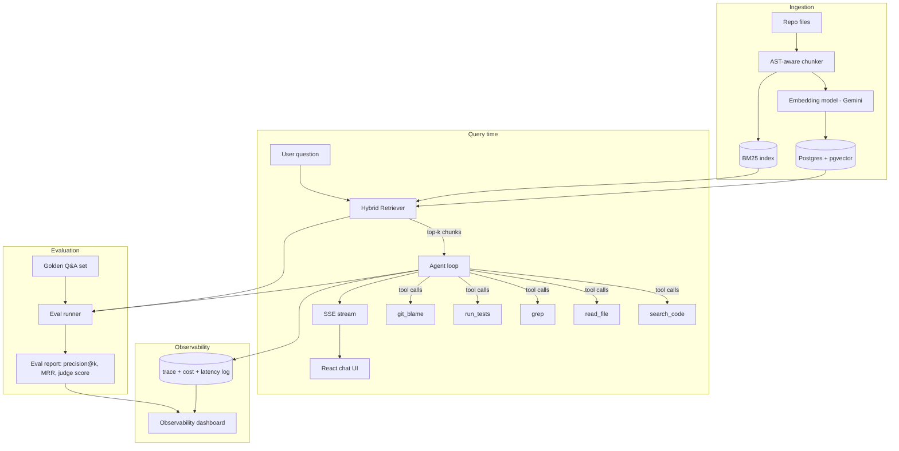

# Architecture

## Components

**Ingestion pipeline** (`backend/app/ingestion`)
Walks a target repo, chunks Python files at function/class boundaries using the `ast` module
(falls back to sliding-window line chunking for non-Python files), attaches metadata (file
path, symbol name, line range, git blame author/date), embeds each chunk with Gemini's
embedding model, and writes to Postgres (`pgvector` column) plus an in-process BM25 index
persisted to disk.

**Hybrid retriever** (`backend/app/retrieval`)
Runs a vector similarity search and a BM25 keyword search in parallel, merges results with
Reciprocal Rank Fusion, and returns the top-k chunks. Hybrid beats vector-only on codebases
because identifiers (`getUserById`, `HYBRID_QUERY_PLANNER`) are exact-match keyword signals
that embeddings often blur.

**Agent loop** (`backend/app/agent`)
A Gemini function-calling loop with five tools: `search_code` (hits the hybrid retriever),
`read_file`, `grep`, `run_tests` (sandboxed subprocess), and `git_blame`. The loop plans,
calls a tool, observes the result, and decides whether to call another tool or answer —
capped at a configurable max-steps to control cost. Every step is streamed to the client over
SSE (mirrors the SSE pattern you already used at Beinex) and logged to the trace table.

**Evaluation harness** (`backend/app/eval`)
A golden set of question → expected-chunk / expected-answer pairs. The runner computes:
- retrieval precision@k and MRR against the expected chunks
- an LLM-as-judge score (0-5) comparing the agent's final answer to a reference answer
- p50/p95 latency and $ cost per query, pulled from the trace log

Results are written as a JSON report and rendered on the observability dashboard, so you can
re-run the eval after any change and see whether you made retrieval better or worse — this is
the piece that turns "I built an AI feature" into "I built and validated an AI feature."

**Observability dashboard** (`frontend/src/pages/Dashboard`)
Charts (Chart.js, matching your existing skill set): latency distribution, cost per query over
time, retrieval precision/MRR trend across eval runs, and a trace explorer showing each agent
step for a given query.

## Data model (Postgres)

- `projects` — one row per ingested repo
- `chunks` — id, project_id, file_path, symbol, start_line, end_line, content, embedding (vector), git metadata
- `queries` — id, project_id, question, final_answer, total_latency_ms, total_cost_usd, created_at
- `trace_steps` — id, query_id, step_index, tool_name, tool_input, tool_output, latency_ms, tokens_in, tokens_out
- `eval_runs` — id, project_id, dataset_name, precision_at_k, mrr, judge_score_avg, created_at

## Why this design is interview-ready

Every component maps to a question you're likely to get asked: "how do you chunk code for
RAG," "how do you decide when the agent should stop calling tools," "how do you know your
retrieval didn't regress," "how do you control LLM cost in production." You'll have a working
answer with numbers, not just an opinion.
